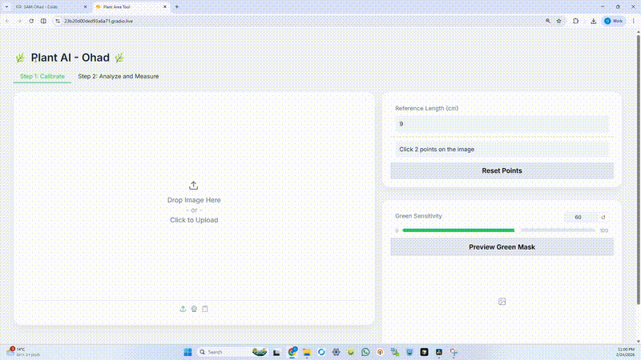

# 🌿 Rosette Segmentation and Area Measurement using AI

AI tool for automatic plant rosette segmentation and total visible area measurement from images using Meta's Segment Anything Model (SAM).

This project segments a single plant rosette from an image and estimates its real-world visible area using image calibration.

This project segments a single plant rosette from an image and estimates its real-world visible area using image calibration.

AI tool for **automatic plant rosette segmentation and area measurement** from images using **Meta's Segment Anything Model (SAM)**.

This project segments a single plant rosette from an image, segments them with AI, and calculates their **real-world surface area** using a calibration step.

A plant rosette refers to the circular arrangement of leaves around the plant center. 
The projected rosette area represents the total visible leaf surface of the plant when viewed from above.
---

## 🎥 Demo



The tool allows interactive plant detection and measurement directly from the browser.

---

## Features

- Automatic plant rosette segmentation using Segment Anything
- Pixel-level segmentation of plant regions
- Green color filtering to isolate vegetation
- Calibration from pixels to real-world units
- Estimation of total visible rosette area
- CSV export of measurements
- Visual overlay of the segmented plant region

---

## 🧠 How It Works

The pipeline:

```
Input Image
      ↓
Segment Anything Model (SAM)
      ↓
Green HSV Filtering
      ↓
Leaf Mask Selection
      ↓
Pixel Area Calculation
      ↓
Calibration
      ↓
Real-World Rosette Area
```

---

## 🛠 Technologies Used

* Python
* PyTorch
* Segment Anything (SAM)
* OpenCV
* NumPy
* Gradio
* Pandas
* Matplotlib

---

## Why this project matters

Rosette area is an important indicator in plant phenotyping and agricultural research.
This project demonstrates how foundation models like SAM can be applied to real-world biological image analysis.

## 📦 Installation

Clone the repository:

```
git clone https://github.com/OhadTal25/plant-area-measurement-ai.git
cd plant-area-measurement-ai
```

Install dependencies:

```
pip install -r requirements.txt
pip install git+https://github.com/facebookresearch/segment-anything.git
```

---

## 📥 Download SAM Model

Download the checkpoint:

```
sam_vit_h_4b8939.pth
```

From:

https://dl.fbaipublicfiles.com/segment_anything/sam_vit_h_4b8939.pth

Place it in the project root directory.

---

## ▶️ Run the Application

```
python app.py
```

The Gradio interface will open in your browser.

---

## 📊 Example Output

The system produces:

• segmented plant regions
• total rosette area calculation
• visual overlay
• CSV file with measurements

---

## 🌱 Potential Applications

Plant phenotyping
Agricultural research
Crop growth analysis
Leaf area estimation
Computer vision experiments

---

## 👨‍💻 Author

**Ohad Tal**

AI & Computer Vision enthusiast exploring automation and real-world AI applications.

GitHub:
https://github.com/OhadTal25

---

## ⭐ If you like this project

Give the repository a star ⭐
